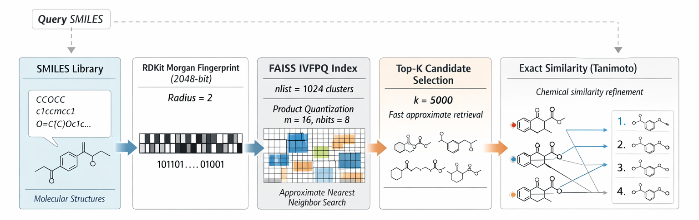

# Billion-Scale Chemical Similarity Search

A high-performance chemical search engine built with C++, RDKit and FAISS for million to billion scale molecular libraries.

It uses Morgan fingerprints, FAISS IVFPQ indexing, and exact reranking with multiple similarity metrics.


## Features

- Morgan fingerprint generation with RDKit
- FAISS IVFPQ approximate nearest neighbor search
- Streaming index construction for large libraries
- Offset-based SMILES retrieval
- Exact reranking with:
  - Tanimoto
  - Dice
  - Tversky
  - Cosine
  - Kulczynski
- Search-time tuning with:
  - `--metric`
  - `--k`
  - `--nprobe` 
## How it works

text
SMILES
  -> RDKit molecule
  -> Morgan fingerprint (2048-bit)
  -> float vector conversion
  -> FAISS IVFPQ indexing
  -> approximate candidate retrieval
  -> exact similarity reranking


<p align="center">  </p> 


<h2>How it works</h2>

<p>
This system combines cheminformatics with large-scale vector search to perform fast chemical similarity search over million- to billion-scale molecular libraries. Molecules are read as SMILES strings, converted into RDKit molecular objects, and then transformed into fixed-length Morgan fingerprints. These fingerprints are used as the searchable representation of each molecule.
</p>

<p>
To make search scalable, the system uses <strong>FAISS IVFPQ</strong> (<em>Inverted File Index + Product Quantization</em>). Instead of comparing every query against every molecule in the database, the vector space is first divided into many coarse regions, and search is restricted to only the most relevant ones.
</p>

<h3>1. Molecular representation</h3>

<p>Each molecule follows the pipeline below:</p>

<pre><code>SMILES -&gt; RDKit molecule -&gt; Morgan fingerprint (2048-bit) -&gt; vector
</code></pre>

<ul>
  <li>Morgan fingerprints encode local chemical environments around atoms.</li>
  <li>Each molecule is represented with the same fixed dimensionality.</li>
  <li>This makes the data suitable for efficient indexing and retrieval.</li>
</ul>

<h3>2. FAISS IVFPQ indexing</h3>

<p>
The core indexing method is IVFPQ, which combines two ideas: first reducing the search space with clustering, and then compressing vectors for memory-efficient storage.
</p>

<h4>2.1 Inverted File Index (IVF)</h4>

<p>
In the IVF stage, the vector space is partitioned into many coarse clusters using a centroid-based method such as k-means. You can think of this as dividing a large city into neighborhoods. Each molecule vector is assigned to the closest centroid, so similar vectors tend to end up in the same region.
</p>

<pre><code>Vector space -&gt; coarse clusters -&gt; each molecule assigned to nearest cluster
</code></pre>

<p>
This means the system no longer needs to search the entire database for every query. Instead, it searches only a limited number of relevant clusters, which dramatically reduces computation.
</p>

<h4>2.2 Residual encoding</h4>

<p>
After assigning a vector to a centroid, the system does not necessarily store only the full original vector directly. Instead, it can represent the vector relative to its assigned centroid:
</p>

<pre><code>residual = vector - centroid
</code></pre>

<p>
This residual representation is more compact and often easier to compress accurately, because it captures the local difference inside a cluster rather than the entire global position in the full vector space.
</p>

<h4>2.3 Product Quantization (PQ)</h4>

<p>
To further reduce memory usage, each residual vector is split into multiple smaller sub-vectors. For example, a vector can be divided into <code>m</code> parts. Each part is then quantized independently by assigning it to the nearest codeword from a learned codebook.
</p>

<pre><code>vector/residual -&gt; split into m sub-vectors -&gt; each sub-vector quantized separately
</code></pre>

<p>
Instead of storing full floating-point values, the system stores compact PQ codes. This greatly reduces storage requirements and makes it possible to keep extremely large indexes in memory-efficient form.
</p>

<p>
In simple terms:
</p>

<ul>
  <li><strong>IVF</strong> decides <em>which neighborhood</em> to search.</li>
  <li><strong>PQ</strong> compresses the vectors inside that neighborhood.</li>
</ul>

<h3>3. Index construction</h3>

<p>
The index is built in a streaming manner so that very large datasets can be processed without loading the entire library into memory at once.
</p>

<ul>
  <li>Read molecules batch by batch from the SMILES file</li>
  <li>Convert each molecule into a Morgan fingerprint</li>
  <li>Transform the fingerprint into a vector representation</li>
  <li>Assign the vector to its nearest IVF cluster</li>
  <li>Compress the vector using PQ</li>
  <li>Insert the compressed representation into the FAISS index</li>
  <li>Store the file offset of the original molecule for later retrieval</li>
</ul>

<p>
Storing file offsets is important because it allows the engine to retrieve the original molecule information directly from disk without duplicating the full raw dataset in RAM.
</p>

<h3>4. Search pipeline</h3>

<p>
At query time, the system follows a multi-stage retrieval strategy that combines fast approximate search with exact chemical reranking.
</p>

<h4>4.1 Query encoding</h4>

<pre><code>Query SMILES -&gt; RDKit molecule -&gt; Morgan fingerprint -&gt; vector
</code></pre>

<p>
The query molecule is converted into the same representation as the indexed molecules.
</p>

<h4>4.2 Cluster selection with <code>nprobe</code></h4>

<p>
The query vector is compared against the coarse centroids, and only the closest clusters are searched. The number of clusters searched is controlled by <code>nprobe</code>.
</p>

<ul>
  <li>Higher <code>nprobe</code> = better recall, but slower search</li>
  <li>Lower <code>nprobe</code> = faster search, but may miss some relevant candidates</li>
</ul>

<p>
This parameter allows the user to balance speed and accuracy depending on the application.
</p>

<h4>4.3 Approximate nearest neighbor retrieval</h4>

<p>
Once the relevant clusters are selected, FAISS scans only those clusters and uses the PQ-compressed vectors to estimate similarity quickly. Instead of searching all molecules, it returns only the top candidate set.
</p>

<pre><code>~1 billion molecules -&gt; restricted clusters -&gt; top-k approximate candidates
</code></pre>

<p>
For example, a billion-molecule database may be reduced to only a few thousand candidate molecules during this stage.
</p>

<h4>4.4 Exact reranking</h4>

<p>
The approximate FAISS stage is very fast, but the final ranking should reflect true chemical similarity. For this reason, the candidate molecules are retrieved and rescored using exact similarity metrics such as Tanimoto.
</p>

<pre><code>Tanimoto = (A ∩ B) / (A ∪ B)
</code></pre>

<p>
This final reranking step combines the speed of approximate vector search with the chemical interpretability and accuracy of exact fingerprint-based similarity scoring.
</p>

<h3>5. Why this approach works</h3>

<ul>
  <li><strong>RDKit</strong> provides robust chemical fingerprint generation.</li>
  <li><strong>IVF</strong> reduces the search space by dividing the database into coarse regions.</li>
  <li><strong>PQ</strong> compresses vectors for efficient storage and fast scanning.</li>
  <li><strong>FAISS ANN search</strong> quickly retrieves a manageable candidate set.</li>
  <li><strong>Exact reranking</strong> restores chemically meaningful ranking quality.</li>
</ul>

<p>
The overall idea is simple: do not brute-force compare a query against every molecule. First narrow the search to the most relevant regions of the space, then retrieve approximate candidates efficiently, and finally apply exact chemical similarity scoring only where it matters.
</p>

<h3>6. End-to-end pipeline</h3>

<pre><code>SMILES
  -&gt; RDKit molecule
  -&gt; Morgan fingerprint
  -&gt; vector conversion
  -&gt; FAISS IVFPQ indexing

Query
  -&gt; encode query molecule
  -&gt; search nearest clusters
  -&gt; retrieve top-k approximate candidates
  -&gt; exact similarity reranking
  -&gt; final ranked results
</code></pre>

<p>
This hybrid design enables scalable billion-scale molecular similarity search with practical memory usage and query times on the order of about one second per query on CPU.
</p>


## ⚙️ Installation

### 1. Create environment

```bash
mamba create -n chem_cpp \
  -c conda-forge \
  python=3.10 \
  cmake make gcc gxx \
  boost-cpp eigen \
  faiss-cpu \
  -y

conda activate chem_cpp


git clone https://github.com/rdkit/rdkit.git
cd rdkit
mkdir build && cd build

cmake \
  -DRDK_BUILD_PYTHON_WRAPPERS=OFF \
  -DRDK_INSTALL_INTREE=OFF \
  -DRDK_BUILD_FREETYPE_SUPPORT=OFF \
  -DRDK_BUILD_CAIRO_SUPPORT=OFF \
  -DCMAKE_INSTALL_PREFIX=$CONDA_PREFIX \
  ..

make -j$(nproc)
make install


git clone https://github.com/onuryus/BSCS.git
cd BSCS

rm -rf build
mkdir build && cd build

cmake ..
make -j$(nproc)
```

##  Usage

### 1. Prepare data

The input file must be a SMILES file named `tam.smi` and placed inside the `data` directory:

```bash
data/tam.smi
```
To run the build_index or search_index programs, navigate to the build directory and execute the commands below:

```bash
./build_index
./search_index
SMILES (exit ile cik): CC1=CC=CC=C1
```
1. On the first run, build the index file  
2. Then, run the search program


Other metrics and an example

```bash
--metric tanimoto
--metric dice
--metric tversky
--metric cosine
--metric kulczynski
./search_index --metric dice --k 3000 --nprobe 64
```


###Output
After the search process is completed, the results are automatically saved to a file named <code>result.txt</code> inside the <code>build/</code> directory.


<pre><code>build/result.txt
</code></pre>

This file contains the ranked search results, including molecule IDs, similarity scores, and corresponding SMILES strings.


<table>
  <thead>
    <tr>
      <th>Parameter</th>
      <th>Description</th>
      <th>Effect on Accuracy</th>
      <th>Effect on Speed</th>
      <th>Default</th>
    </tr>
  </thead>
  <tbody>
    <tr>
      <td><code>--metric</code></td>
      <td>Similarity metric used for reranking results</td>
      <td>High (defines final ranking)</td>
      <td>Low impact</td>
      <td><code>tanimoto</code></td>
    </tr>
    <tr>
      <td><code>--k</code></td>
      <td>Number of candidates retrieved from FAISS before reranking</td>
      <td>Higher → better recall</td>
      <td>Higher → slower reranking</td>
      <td><code>5000</code></td>
    </tr>
    <tr>
      <td><code>--nprobe</code></td>
      <td>Number of clusters searched in FAISS (IVF search scope)</td>
      <td>Higher → better accuracy</td>
      <td>Higher → slower search</td>
      <td><code>32</code></td>
    </tr>
  </tbody>
</table>


## 📊 Performance

###  Summary 

Tested on ~1 billion molecules:

##  Performance

### 📈  Summary

<table>
<tr>
<td width="50%" valign="top">

###  Summary

<table>
  <thead>
    <tr>
      <th>Metric</th>
      <th>Value</th>
    </tr>
  </thead>
  <tbody>
    <tr>
      <td>Dataset size</td>
      <td>~1 Billion molecules</td>
    </tr>
    <tr>
      <td>Index build time</td>
      <td>~14 hours (one-time cost)</td>
    </tr>
    <tr>
      <td>Query time</td>
      <td>~1 second per query (CPU only)</td>
    </tr>
    <tr>
      <td>Memory usage</td>
      <td>~12–14 GB RAM</td>
    </tr>
  </tbody>
</table>

</td>

<td width="50%" valign="top">

### 📈

```text
Index build (one-time)
████████████████████████████████████████ 14 hours

Query time
█ 1 second

Memory usage
██████████████ 12–14 GB
```
<p><strong>⚡ Note:</strong> Indexing is a one-time cost.  
Once the index is built, it can be reused for all future searches without rebuilding.</p>
